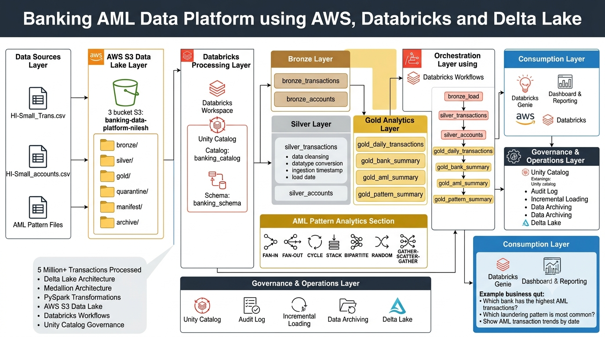

# Banking AML Data Platform using AWS, Databricks & Delta Lake

## Overview

This project demonstrates an end-to-end Anti-Money Laundering (AML) data platform built using AWS S3, Databricks, Unity Catalog, Delta Lake, and PySpark following the Medallion Architecture (Bronze, Silver, Gold).

The platform processes more than 5 million banking transactions, performs AML analytics, identifies laundering patterns, automates data pipelines using Databricks Workflows, and enables natural language analytics through Databricks Genie.

---

## Architecture Diagram



---

## Technology Stack

* AWS S3
* Databricks
* Unity Catalog
* Delta Lake
* PySpark
* Databricks Workflows
* Databricks Genie
* GitHub
* Python

---

## Dataset Information

### Transaction Dataset

* HI-Small_Trans.csv
* ~5 Million Transactions

### Account Dataset

* HI-Small_accounts.csv
* ~500K Account Records

### AML Pattern Dataset

* HI-Small_Patterns.txt

---

## Data Lake Structure

```text
banking-data-platform-nilesh

bronze/
silver/
gold/
quarantine/
manifest/
archive/
```

---

## Medallion Architecture

### Bronze Layer

Raw data ingestion from source files.

Tables:

* bronze_transactions
* bronze_accounts

---

### Silver Layer

Data cleansing and standardization.

Transformations:

* Datatype conversions
* Column standardization
* Timestamp formatting
* Data quality validation
* Metadata enrichment

Tables:

* silver_transactions
* silver_accounts

---

### Gold Layer

Business-ready analytical datasets.

Tables:

* gold_daily_transactions
* gold_bank_summary
* gold_aml_summary
* gold_pattern_summary

---

## AML Analytics

Implemented AML-specific analytics including:

* Daily AML transaction monitoring
* AML transaction volume tracking
* AML amount analysis
* Bank-level AML activity analysis
* Payment method risk analysis

Example metrics:

* Total Transactions Processed: 5M+
* AML Transactions Identified
* AML Transaction Amounts
* Daily AML Trends

---

## Pattern Analytics

The project analyzes common money laundering typologies.

Supported patterns:

* FAN-IN
* FAN-OUT
* CYCLE
* STACK
* BIPARTITE
* RANDOM
* GATHER-SCATTER
* SCATTER-GATHER

Pattern summary is stored in:

```text
gold_pattern_summary
```

---

## Workflow Orchestration

Databricks Workflow automates the complete pipeline.

```text
bronze_load
      ↓
silver_transactions
      ↓
silver_accounts
      ↓
gold_daily_transactions
      ↓
gold_bank_summary
      ↓
gold_aml_summary
      ↓
gold_pattern_summary
```

---

## Governance & Monitoring

### Unity Catalog

Used for:

* Centralized metadata management
* Table governance
* Data discovery
* Access management

### Audit Logging

Audit framework implemented to capture:

* Job Name
* Run Timestamp
* Records Read
* Records Written
* Status

Table:

```text
audit_log
```

---

## Databricks Genie

Natural language analytics capability enables users to ask questions such as:

* Which bank has the highest AML transactions?
* Which laundering pattern is most common?
* Show AML transaction trends by date.
* Compare FAN-IN and FAN-OUT activity.

---

## Key Learnings

* Medallion Architecture Implementation
* Delta Lake Fundamentals
* Unity Catalog Governance
* Databricks Workflow Orchestration
* AML Analytics
* Pattern Detection
* Audit Framework Design
* Incremental Loading Concepts
* Data Archiving Strategies

---

## Future Enhancements

* Incremental Data Loading
* API-Based Ingestion
* Streaming Pipelines
* CI/CD Integration using GitHub
* Automated Data Archival
* Delta Optimization and Maintenance

---

## Repository Structure

```text
banking-aml-data-platform-databricks/

architecture/
notebooks/
├── bronze/
├── silver/
├── gold/
├── pattern_analysis/
└── audit/

screenshots/
docs/
README.md
```

---

## Author

Nilesh Desai

Data Engineering Project focused on AWS, Databricks, Delta Lake, PySpark, AML Analytics, and Medallion Architecture.
